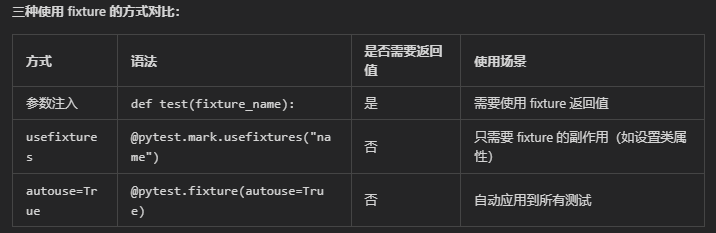
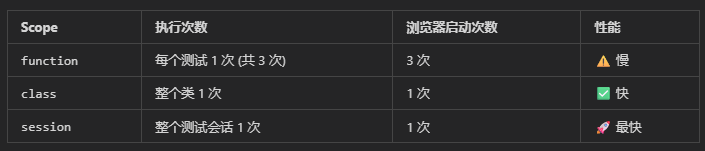

以 test_login.py 举例 

---------
✅ Pytest 标记（Mark）指南
📍 标记已设置位置 pytest.ini（项目根目录）
📍 可以直接在代码中使用 @pytest.mark.标记名
📍支持逻辑组合：and、or、not

只运行带 smoke 标记的测试：
pytest -m smoke
运行带 smoke 和 slow 标记的测试
pytest -m "smoke and not slow"

----------